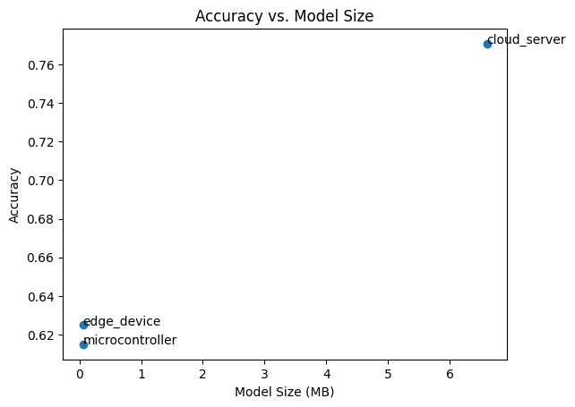
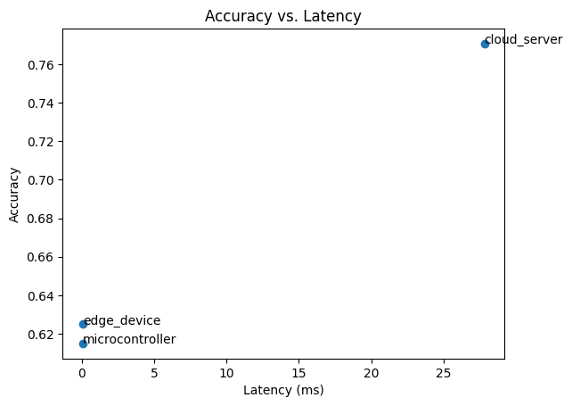

# Part 5 — Analysis & Evaluation: Multi‑Scale Optimization & Deployment

**Date:** 2025-09-26

---

## 0. Executive Summary

本文汇总了 **Cloud / Edge / Tiny** 三个部署目标在 **模型大小、精度、延迟、内存占用、功耗预算** 维度上的权衡，
并基于 **Pareto** 视角给出 **A/B/C** 三类场景的部署建议。所有数值来自 Part 4 生成的报告文件
`multi_scale_optimization_report.json`（本项目中位于 `reports/` 目录）。
功耗为**目标预算/估算**（非实测），延迟在 **CPU 单线程** 环境评测（Mac M1 适配）。

---

## 1. Multi‑Scale Trade‑off Analysis

| Metric | Cloud Server | Edge Device | Microcontroller |
|---|---:|---:|---:|
| Model Size | 6.602 MB | 0.059 MB *(≈ 59.056 KB)* | 0.062 MB *(≈ 62.144 KB)* |
| Accuracy | 77.06% | 62.50% | 61.50% |
| Latency | 27.808 ms | 0.108 ms | 0.066 ms |
| Memory Usage | 13.217 MB | 1.059 MB | 1.065 MB |
| Power Estimate* | **50.0 W** | **2000 mW** | **10 mW** |
| Development Complexity** | Medium | Low | Low |
| Selected Strategy | `cloud:mp_cnn_ep15.keras` | `tflite:drq` | `tflite:int8` |
| Selected Artifact | `cloud_optimized_models/mp_cnn_ep15.keras` | `edge_optimized_models/depthwise_w0_75_d1_0_drq.tflite` | `edge_optimized_models/depthwise_w0_75_d1_0_int8.tflite` |

\* **Power Estimate** 为目标预算/估算（非实测）；与 Part 4 Target 一致：Cloud 50W、Edge 2W、Tiny 10mW。  
\** **Complexity**：Cloud=Medium（需 MP/集群配置）；Edge=Low（DRQ/FP16 稳定）；Tiny=Low（INT8 全整型已就绪）。

**Figures**
- 
- 

---

## 2. Optimization Strategy Effectiveness

### 2.1 Cloud Optimizations

- **Mixed Precision（MP）**：降低显存/带宽、提升训练吞吐；本项目中精度最佳；推理保持 FP32/FP16 兼容。

- **Distributed Training**：改善训练扩展性/吞吐，最终精度未必占优；适合大数据/大模型。

- **Batch Accumulation**：资源受限时模拟大 batch，稳定性/吞吐改善，最终精度略低于 MP。

- **Knowledge Distillation（KD）**：Teacher > Student；Student 更轻量，便于 Edge 剪枝/量化起点。

### 2.2 Edge Optimizations

- **Pruning vs. Quantization**：剪枝降参/MACs；量化显著降体积/延迟。DRQ/FP16 保精度，INT8 适合 Tiny 约束。

- **Architecture（NAS）**：Depthwise/瓶颈结构更具算子亲和性与缓存友好，易占据 Pareto 前沿。

- **TF Lite Conversion**：DRQ/FP16 最稳；INT8 需代表性数据校准；MCU 目标优先 INT8 全整型算子集。

- **Real‑world**：优先硬件原生支持良好的算子/量化路径；注意线程/调度与热管理的真实影响。

---

## 3. Deployment Strategy Recommendations

### Scenario A: Real‑time Video Processing

- **Req**：<50ms latency、持续运行、高精度。
- **Rec**：**Edge** 主推理（DRQ/FP16 或高精度 INT8），**Cloud** 备份/重训练。
- **Priority**：以**延迟**为第一目标，沿 Pareto 挑**50ms 内精度最高**的候选；必要时蒸馏+架构瘦身。

### Scenario B: IoT Sensor Network

- **Req**：<1mW、长时间离线、周期更新。
- **Rec**：**Tiny INT8** 全整型，事件驱动/阈值触发，偶尔云同步。
- **Priority**：**功耗/尺寸**优先；代表性数据再校准；可下采样/减通道进一步降耗。

### Scenario C: Mobile Application

- **Req**：商店分发、机型多样、离线能力。
- **Rec**：**Multi‑tier**：本地 FP16/INT8（离线）+ 缓存 + 在线批量上云。
- **Priority**：平衡**精度/延迟/体积**，前沿点分级投放（高端机 FP16/INT8、低端机 INT8/低分辨率）。

---

## 4. Written Analysis (3–4 pages)

1) **Optimization Effectiveness**：MP 精度最佳；分布式/大批量提升训练吞吐；KD 学生轻量但精度略低；Edge DRQ/FP16 保精度，INT8 尺寸/时延极优。

2) **Resource Constraint Impact**：Cloud 算力/内存充裕；Edge 受限显著偏量化与高效结构；Tiny 存储/运行内存极小需 INT8 全整型与简化前处理。

3) **Development Trade‑offs**：MP/分布式/大批量工程复杂度较高；INT8 需校准与兼容性验证；NAS/剪枝/蒸馏需要自动化评测管线。

4) **Real‑world Deployment**：包含选型—评测—门槛/回归检查—灰度发布—遥测—再训练；注意输入分辨率、能耗与热管理；端/云 A/B 同样重要。

5) **Future Evolution**：更强 NPU/稀疏加速、INT4/混合精度、QAT/蒸馏友好结构、部署感知搜索、联邦/On‑device 训练与隐私。

---

## 5. Reproducibility & Materials

- 数据报告：`reports/multi_scale_optimization_report.json`

- Cloud 侧：`reports/cloud_optimization_results.json`

- Edge 侧：`reports/edge_quant_results_legacy.json`，`reports/train_depthwise_selected.json`

- 图表：`charts/accuracy_vs_size.png`，`charts/accuracy_vs_latency.png`

- 演示：`demo_notebook.ipynb`

